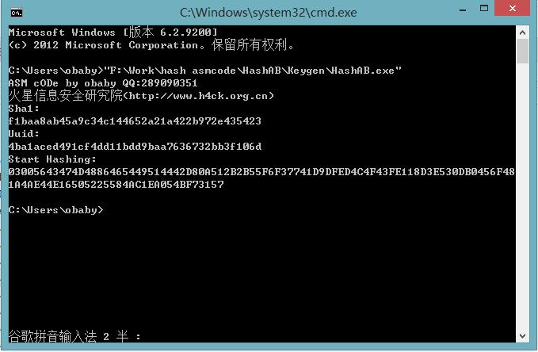
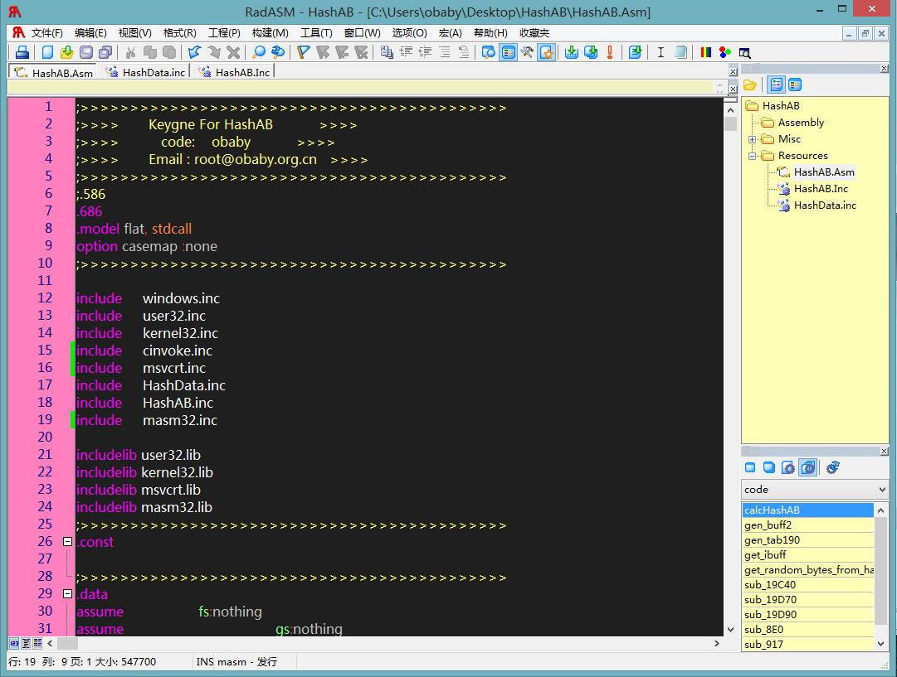

HashAB for iOS 4.x
======

HashAB for iOS 4.x screenshot:

Source code screenshot:

Howerver , I have removed the Data code from the project ,if u want to complie it ,u have to fix 
the data refered urself!
=======
hashab
======

